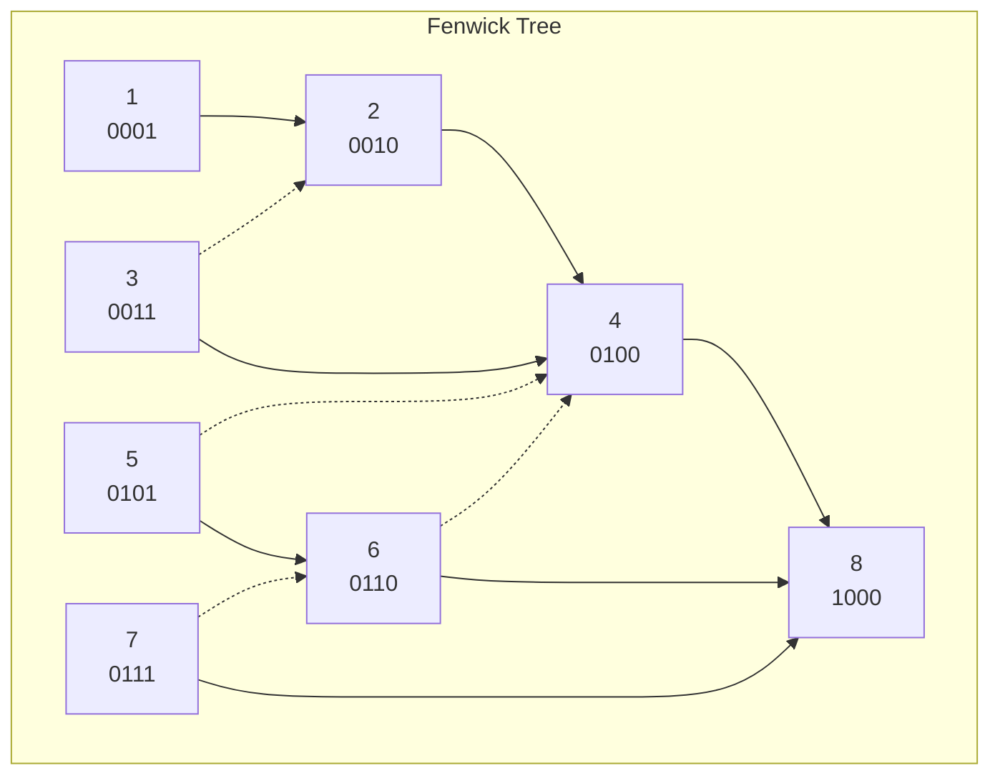

# Fenwick Tree (Binary Indexed Tree)

A Fenwick Tree — also called a Binary Indexed Tree (BIT) — is a data structure
that supports two operations on an array of numbers in **O(log n)** time each:

- **Point update**: change the value at a single index
- **Prefix query**: compute the sum of all elements from index 1 up to index i

This makes it a practical middle ground between a plain array (O(1) update,
O(n) query) and a prefix-sum array (O(n) update, O(1) query).

---

## The core idea: each cell stores a partial sum

Instead of storing each element individually, a Fenwick tree stores **partial
sums**. Each cell `tree[i]` is responsible for a block of consecutive elements.
The length of that block is determined by the **lowest set bit** of `i`.

For a 1-indexed array of 8 elements:

| Index (i) | Binary | Lowest set bit | Block covered    |
|-----------|--------|----------------|------------------|
| 1         | 0001   | 1              | a[1]             |
| 2         | 0010   | 2              | a[1..2]          |
| 3         | 0011   | 1              | a[3]             |
| 4         | 0100   | 4              | a[1..4]          |
| 5         | 0101   | 1              | a[5]             |
| 6         | 0110   | 2              | a[5..6]          |
| 7         | 0111   | 1              | a[7]             |
| 8         | 1000   | 8              | a[1..8]          |

The lowest set bit is computed with the two's-complement trick `i & (-i)`.

---

## Update and query traversals



**Solid arrows — update path.**
When element `i` changes, every cell whose block includes `i` must be updated.
Starting at `i`, the next cell to update is found by **adding** the lowest set
bit: `i += i & (-i)`. This climbs the tree upward until the index exceeds n.

Example — updating index 3 (`0011`):
1. Visit 3 (`0011`), add `1` → move to 4 (`0100`)
2. Visit 4 (`0100`), add `4` → move to 8 (`1000`)
3. Visit 8 (`1000`), done

**Dotted arrows — query path.**
To compute the prefix sum up to index `i`, start at `i` and **subtract** the
lowest set bit: `i -= i & (-i)`. This strips off the rightmost `1`-bit each
step, collecting non-overlapping partial sums that together cover `[1..i]`.

Example — querying prefix sum up to index 7 (`0111`):
1. Add `tree[7]` (covers a[7]), subtract `1` → move to 6 (`0110`)
2. Add `tree[6]` (covers a[5..6]), subtract `2` → move to 4 (`0100`)
3. Add `tree[4]` (covers a[1..4]), subtract `4` → move to 0, stop

Result: `tree[7] + tree[6] + tree[4]` = sum of `a[1..7]`. Only 3 steps for 7
elements — this is the O(log n) behaviour.

---

## Range query

A Fenwick tree natively computes **prefix sums**, but range sums follow
directly:

```
sum(left, right) = prefix(right) - prefix(left - 1)
```

---

## Complexity

| Operation   | Time      | Space |
|-------------|-----------|-------|
| Build       | O(n log n)| O(n)  |
| Point update| O(log n)  | —     |
| Prefix query| O(log n)  | —     |
| Range query | O(log n)  | —     |

Space is O(n) — the tree array is the same length as the input.

---

## Strengths

- **Simple to implement.** The entire structure is a flat array; no pointers or
  tree nodes.
- **Cache-friendly.** All data lives in one contiguous array, so traversals
  benefit from CPU cache locality.
- **Low constant factor.** Each update or query touches at most log₂(n) cells.
  For n = 10⁶ that is roughly 20 operations.
- **Low memory overhead.** Uses exactly n + 1 integers — no auxiliary pointers
  or metadata.

## Weaknesses

- **Prefix sums only (in the basic form).** The standard Fenwick tree supports
  sum, but extending it to other operations (min, max, GCD) requires extra work
  or a different structure such as a segment tree.
- **Point updates only (in the basic form).** Range updates require a second
  tree or a difference-array technique.
- **1-indexed internally.** The off-by-one between the 0-based public API and
  the 1-based internal tree is a common source of bugs.
- **Not intuitive.** The relationship between the tree structure and the bit
  manipulation is non-obvious, making the code harder to read and debug than a
  plain prefix-sum array.

---

## Comparison with alternatives

| Structure      | Update  | Query  | Range update | Notes                        |
|----------------|---------|--------|--------------|------------------------------|
| Plain array    | O(1)    | O(n)   | O(n)         | Simple but slow queries      |
| Prefix sum     | O(n)    | O(1)   | O(n)         | Fast queries, slow updates   |
| Fenwick tree   | O(log n)| O(log n)| O(log n)*  | Best all-round for sum       |
| Segment tree   | O(log n)| O(log n)| O(log n)   | More flexible, higher overhead|

*With a difference-array extension.

---

## When to reach for a Fenwick tree

| Situation | Good fit? |
|---|---|
| Frequent prefix sum queries + point updates | ✅ Perfect |
| Range sum queries (can reduce to two prefix sums) | ✅ Yes |
| Static array, queries only | ❌ Plain prefix sum is simpler |
| Range updates + range queries | ⚠️ Possible but a segment tree is cleaner |
| Need to find k-th smallest element | ✅ With BIT on frequency array |


---

## Applications

**Competitive programming**
Range-sum queries after frequent updates are a staple of contests. A Fenwick
tree is often the first tool reached for because it is fast to code and has a
small constant factor.

**Order statistics / rank queries**
Given a stream of integers, "how many values seen so far are ≤ x?" can be
answered with a Fenwick tree indexed by value. Each new number is an update;
each rank question is a prefix query.

**Counting inversions in an array**
An inversion is a pair (i, j) where i < j but a[i] > a[j]. Scanning right to
left and querying "how many elements already inserted are smaller than a[i]"
counts inversions in O(n log n), replacing the O(n²) naive approach.

**2D range sums**
A 2D Fenwick tree (tree of trees) answers sum queries over rectangles in
O(log² n) time — used in image processing for integral images and in spatial
databases for aggregate queries over grid regions.

**Cumulative frequency tables**
Applications that track cumulative distributions in real time — histograms,
percentile tracking, cumulative vote tallies — benefit from O(log n) updates
and queries instead of rebuilding the prefix array on every change.
